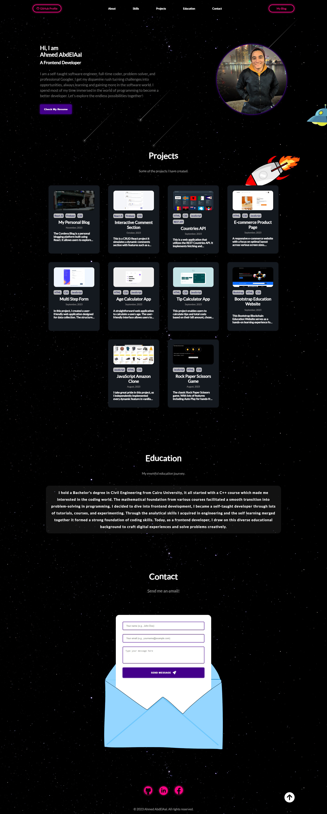

# My Portfolio

Welcome to my portfolio! This project is a showcase of my skills, projects, and experiences as a frontend developer.

## Links
[Live Website](https://xcordeva.github.io/)

### Desktop Version

## Table of Contents

- [Introduction](#introduction)
- [Features](#features)
- [Built With](#technologies-used)
- [Installation](#installation)
- [Usage](#usage)
- [Contributing](#contributing)
- [License](#license)

## Introduction

**My Portfolio** is a personal project built using React.js, designed to serve as an online portfolio, offering insights into my work, skills, and achievements. It provides an overview of my background, showcases projects, and offers a seamless way to get in touch.

## Features

1. **About Me:** Explore my background, skills, and experiences.
2. **Resume:** Download my resume directly from the portfolio.
3. **Skills:** A comprehensive list of my technical skills and proficiencies.
4. **Projects:** A curated collection of my notable projects with detailed descriptions, screenshots, and project links.
5. **Contact:** A user-friendly form for sending messages or inquiries.

## Built With

- React.Js
- Redux.Js
- CSS3
- HTML5 
- JavaScript

## Installation

To run this portfolio locally, follow these steps:

1. Clone the repository: `git clone https://github.com/xCordeva/xcordeva.github.io.git`
2. Navigate to the project directory: `cd xcordeva.github.io`
3. Install the dependencies: `npm install`
4. Start the development server: `npm start`
5. Open your browser and visit: [http://localhost:3000](http://localhost:3000)

## Usage

Use the navigation menu to explore, Dive into the About Me section for insights into my background and skills, Explore the Projects section for detailed glimpses of my creations, Use the Contact section to send me a message or inquiry.

## License
This project is licensed under the [MIT License](https://github.com/xCordeva/xcordeva.github.io/blob/main/LICENSE).

